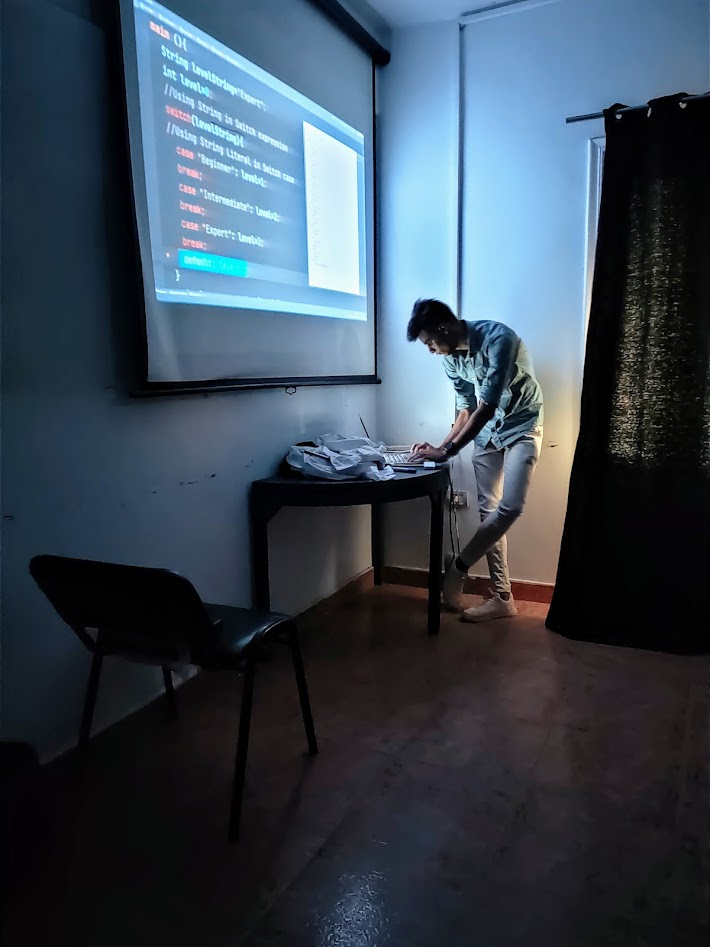

# flutter instructor ✍🏻

### Hi there 👋, my name is sherif
#### Moblie developer (Flutter - Cross Platform) (Android - Native )

A mobile app developer is able to create software for phones and tablets, and is familiar with the newest technologies in the mobile world. Mobile development requires staying in the mobile head space, meaning that it's even more important than with other hardware contexts to optimize performance, battery, network, and memory management. A developer must be also aware of how to deal with device fragmentation,often working closely with a designer to achieve the best user experience (UX) results.

Skills: tech: Android , Flutter / science : Clean Code , Clean Arch , DP , oop ,Algh&Data Struc 

- 🔭 I’m currently working on this page. 

<h2 align="center"> 🔭 Tools of Trade</h2>

  &nbsp;&nbsp;&nbsp;
  &nbsp;&nbsp;&nbsp;
  &nbsp;&nbsp;

  

# Github Stats

## *Connect with me*

* 
* 
* 
* 
 

<h2  align="center">💻 Check Out My Repos ⬇️ </h2>

